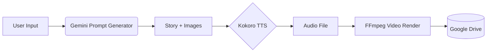
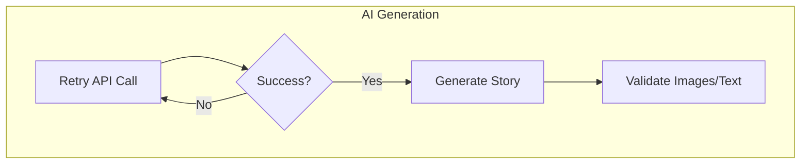
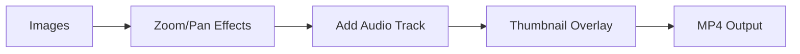

# ✨ AI-Powered Children's Story Generator

*Automatically create animated story videos with Gemini AI, Kokoro TTS, and FFmpeg.*


## 🌟 Project Overview

This project automates the creation of high-quality animated children's stories from start to finish using AI. It generates engaging narratives with matching images, converts text to natural-sounding speech, combines everything into a professionally animated video, and uploads the result to Google Drive.

### ✨ Key Features

- **AI-Generated Content**: Creates original stories and matching images using Google's Gemini AI models
- **Text-to-Speech**: Converts story text to natural audio narration using Kokoro TTS
- **Professional Video Production**: Automatically creates videos with Ken Burns effects, transitions, and more
- **SEO Optimization**: Generates YouTube-ready titles, descriptions and tags
- **Custom Thumbnails**: Creates eye-catching video thumbnails with text overlay
- **Google Drive Integration**: Seamlessly uploads and organizes videos in the cloud

## 📊 Workflow Diagrams

### Data Flow Between Modules



*Figure 1: How data flows through the system, from user input to final video upload.*

### AI Generation Pipeline



*Figure 2: The AI generation process with built-in retry logic for reliability.*

### Video Rendering Process



*Figure 3: The video rendering pipeline showing how images and audio are combined with effects.*

## 🔍 How It Works

### Step 1: Story Prompt Generation
User provides a concept or the system generates a creative prompt automatically using Gemini AI.

```python
# Example prompt
"Generate a story about a white baby goat named Pip going on an adventure in a farm"
```

### Step 2: AI Content Generation
The system uses Google's Gemini AI to:
- Generate a complete narrative with multiple segments
- Create high-quality images in 16:9 aspect ratio for each story scene
- Ensure content is family-friendly and visually appealing

### Step 3: Audio Narration
Kokoro TTS engine converts story text to natural-sounding speech:
- Processes the narrative segment by segment
- Combines audio chunks with appropriate pauses
- Creates a single cohesive audio file

### Step 4: Video Production
FFmpeg combines images and audio into a professional video:
- Applies Ken Burns effects (zoom and pan) to static images
- Adds fade transitions between scenes
- Synchronizes audio narration with visuals
- Creates a proper 16:9 widescreen format

### Step 5: Metadata & Upload
- Generates SEO-optimized title, description and tags
- Creates a custom thumbnail with text overlay
- Uploads everything to Google Drive in an organized folder structure
- Provides direct download links

## 🛠️ Setup Instructions

### Prerequisites
- Python 3.8 or higher
- FFmpeg installed on your system
- Google Drive API credentials
- Gemini API key

### Installation

1. Clone the repository
```bash
git clone https://github.com/yourusername/ai-story-generator.git
cd ai-story-generator
```

2. Install dependencies
```bash
pip install -r requirements.txt
```

3. Configure API keys
   - Obtain a Gemini API key from [Google AI Studio](https://makersuite.google.com/)
   - Add your key to the environment:
```bash
# Linux/macOS
export GEMINI_API_KEY=your_api_key_here

# Windows PowerShell
$env:GEMINI_API_KEY = "your_api_key_here"
```

4. Set up Google Drive API
   - Create a Google Cloud project
   - Enable the Google Drive API
   - Create and download OAuth 2.0 credentials

## 🚀 Usage Examples

### Basic Usage
Run the project with default settings:

```bash
python main.py
```

This will:
1. Generate a creative story prompt
2. Create a complete story with images
3. Convert text to speech
4. Produce a video
5. Upload to Google Drive

### Custom Story Prompt
Provide your own story concept:

```python
from main import main

# Use a custom prompt to guide the story generation
main(prompt_input="A curious fox exploring a magical forest with talking trees")
```

### Programmatic API
Use the components in your own Python code:

```python
from ai.story_generator import generate
from media.video import create_video_from_images_and_audio

# Generate content
result = generate(use_prompt_generator=True)

# Access generated assets
story_text = result['story_text']
image_files = result['image_files']
audio_file = result['audio_file']
video_file = result['video_file']
```

## 📁 Project Structure

```
/project_root/
│
├── google_drive/           # Google Drive API operations
│   ├── __init__.py
│   ├── api_client.py       # Drive auth, file ops
│   └── uploader.py         # Video/metadata upload
│
├── ai/                     # AI-related functions
│   ├── __init__.py
│   ├── prompt_generator.py # generate_prompt, retry_api_call
│   ├── story_generator.py  # generate, retry_story_generation
│   └── seo.py              # generate_seo_metadata, default_seo_metadata
│
├── media/                  # Media processing
│   ├── __init__.py
│   ├── audio.py            # Kokoro TTS integration
│   ├── video.py            # FFmpeg video creation, thumbnail
│   └── utils.py            # collect_complete_story
│
├── main.py                 # Entry point (orchestrates all modules)
└── config.py               # Constants (API keys, safety_settings)
```

## 📝 Expected Output

The system produces:

1. **Story Text**: A complete narrative with multiple segments
2. **Images**: 6+ high-quality images matching the story
3. **Audio**: Professional narration of the story
4. **Video**: Animated MP4 with transitions and effects
5. **Thumbnail**: Custom image for video platforms
6. **Metadata**: SEO-optimized title, description and tags

Example output video:


## 🔄 Creating the Animations

To create the animated workflow diagrams for this README:

1. **MermaidJS Animations**:
   - Use the Mermaid Live Editor: https://mermaid.live/
   - Copy the flowchart code from this README
   - Export as SVG or record as GIF using screen recording

2. **ScreenToGif for Process Recording**:
   - Download ScreenToGif: https://www.screentogif.com/
   - Record the application running to show the actual workflow
   - Edit and optimize the GIF for web embedding

3. **Matplotlib for Data Flow**:
   - Use Python's Matplotlib to create animated data flow visualizations
   - Save as GIF and embed in the README

## 🚀 Google Colab Quick Start

Use this single cell to run the entire project in Google Colab:

```python
# AI-Powered Children's Story Generator - Complete Colab Cell

# Clone the repository
!git clone https://github.com/abhiraman9012/Kids-Video.git
%cd Kids-Video

# Install dependencies and FFmpeg
!pip install -r requirements.txt
!apt-get update && apt-get install -y ffmpeg

# Run the entire project with one command
# This handles all steps: Gemini story generation, image creation, 
# audio narration, video creation, and Google Drive upload
!python main.py
```

> **Tip**: In Colab, select Runtime → "Change runtime type" → Hardware accelerator: "T4 GPU" for faster processing

## 📜 License

This project is licensed under the MIT License - see the LICENSE file for details.

## 🙏 Acknowledgements

- [Google Gemini AI](https://deepmind.google/technologies/gemini/) for content generation
- [Kokoro TTS](https://github.com/ynop/kokoro) for text-to-speech capabilities
- [FFmpeg](https://ffmpeg.org/) for video processing

## 🔄 Complete Animated Workflow

The following diagram shows the entire process flow with detailed steps and animations:

```mermaid
%%{init: {'theme': 'dark', 'themeVariables': { 'primaryColor': '#597ea2', 'primaryTextColor': '#fff', 'primaryBorderColor': '#597ea2', 'lineColor': '#d3d3d3', 'secondaryColor': '#373a42', 'tertiaryColor': '#2f333a'}}}

flowchart TB
    classDef input fill:#6a9955,stroke:#529752,color:#fff
    classDef ai fill:#af5aff,stroke:#9355d9,color:#fff
    classDef media fill:#4b91ff,stroke:#3a7ad9,color:#fff
    classDef output fill:#ff7043,stroke:#d95e38,color:#fff
    classDef storage fill:#4caf50,stroke:#3e9142,color:#fff
    
    %% Start and Environment Setup
    Start(Start) --> EnvSetup{Set API Keys}
    EnvSetup -->|Success| GDriveTest{Test Google Drive}
    EnvSetup -->|Failure| ErrorExit[Exit with Error]
    GDriveTest -->|Success| PromptFlow
    GDriveTest -->|Failure| PromptFlow
    
    subgraph PromptFlow ["Prompt Generation (ai/prompt_generator.py)"]
        direction TB
        UserInput["User Input"]:::input --> PromptGen["generate_prompt()"]:::ai
        PromptGen -->|API Call| GenAI{"Gemini AI
        PROMPT_MODEL"}:::ai
        GenAI -->|Retry| GenAI
        GenAI --> PromptResult["Creative Prompt"]:::output
    end
    
    PromptFlow --> StoryFlow
    
    subgraph StoryFlow ["Story Generation (ai/story_generator.py)"]
        direction TB
        PromptInput["Prompt"]:::input --> StoryGen["retry_story_generation()"]:::ai
        StoryGen --> GenStory{"Gemini AI
        STORY_MODEL"}:::ai
        GenStory -->|Retry| GenStory
        GenStory --> RawOutput["Raw AI Output"]:::output
        RawOutput --> TextProc["collect_complete_story()
        (media/utils.py)"]:::media
        TextProc --> StoryText["Clean Story Text"]:::output
        GenStory --> ImagesOut["Generated Images"]:::output
    end
    
    StoryFlow --> AudioFlow
    StoryFlow --> SEOFlow
    
    subgraph AudioFlow ["Audio Creation (media/audio.py)"]
        direction TB
        StoryInput["Story Text"]:::input --> TTSGen["generate_audio_from_text()"]:::media
        TTSGen --> Kokoro{"Kokoro TTS
Engine"}:::media
        Kokoro --> AudioChunks["Audio Segments"]:::media
        AudioChunks --> AudioMerge["Combine Audio"]:::media
        AudioMerge --> FinalAudio["Complete Audio File"]:::output
    end
    
    subgraph SEOFlow ["SEO Metadata (ai/seo.py)"]
        direction TB
        SEOInput["Story + Images"]:::input --> SEOGen["generate_seo_metadata()"]:::ai
        SEOGen -->|API Call| SEOAI{"Gemini AI"}:::ai
        SEOAI -->|Fallback| DefaultSEO["default_seo_metadata()"]:::ai
        SEOAI --> Metadata["Title, Description, Tags"]:::output
    end
    
    AudioFlow --> VideoFlow
    SEOFlow --> VideoFlow
    
    subgraph VideoFlow ["Video Creation (media/video.py)"]
        direction TB
        ImagesIn["Generated Images"]:::input --> VideoGen["create_video_from_images_and_audio()"]:::media
        AudioIn["Audio File"]:::input --> VideoGen
        VideoGen --> Effects["Apply Ken Burns
Zoom/Pan Effects"]:::media
        Effects --> Transitions["Add Fade
Transitions"]:::media
        Transitions --> AudioSync["Sync Audio
with Images"]:::media
        AudioSync --> MP4Out["Final MP4 Video"]:::output
        
        ImagesIn --> Thumbnail["generate_thumbnail()"]:::media
        SEOIn["SEO Metadata"]:::input --> Thumbnail
        Thumbnail --> ThumbOut["Video Thumbnail"]:::output
    end
    
    VideoFlow --> UploadFlow
    
    subgraph UploadFlow ["Upload to Google Drive (google_drive/uploader.py)"]
        direction TB
        VideoFile["Video File"]:::input --> GDriveUpload["upload_video_to_drive()"]:::storage
        ThumbFile["Thumbnail"]:::input --> GDriveUpload
        MetadataFile["SEO Metadata"]:::input --> GDriveUpload
        GDriveUpload --> GDrive[("Google Drive")]:::storage
        GDrive --> VideoLink["Shareable Link"]:::output
    end
    
    UploadFlow --> Complete(["Generation Complete"])
    
    %% Animation and styling annotations
    %% Animation sequence: data flows from top to bottom
    %% Modules highlight in sequence as data passes through
    %% Retry loops animate with pulsing arrows
    %% Final upload shows confirmation animation
```

*Figure 4: Complete animated workflow showing the entire process from initialization to final upload. The animation shows data flowing through each module with retry mechanisms and processing steps.*

This animated diagram illustrates the complete end-to-end workflow:

1. **Environment Setup**: Checks API keys and Google Drive access
2. **Prompt Generation**: Uses Gemini to create or enhance the story prompt
3. **Story Generation**: Generates the story text and matching images with built-in retry logic
4. **Parallel Processing**:
   - **Audio Creation**: Converts story to speech using Kokoro TTS
   - **SEO Metadata**: Generates YouTube-friendly titles and descriptions
5. **Video Creation**: Combines images and audio with professional effects
6. **Upload**: Sends the completed video to Google Drive with metadata

Each component communicates through well-defined interfaces, making the system modular and maintainable.
